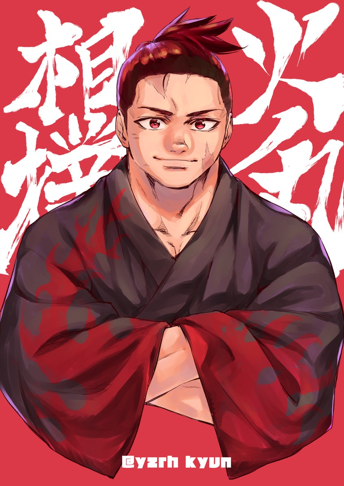

# Yokozuna

Monorepo to collect progress on learning algorithms and data structures;
and solving challenges from multiple platforms.

The name of the repo serves as an inspiration and motivation to be better
and strive for greatness.

## Road to yokozuna

> From Japanese 横綱よこづな (yokozuna, “wide rope”), the symbol of their rank worn
about the waist.

    

***Yokozuna*** is the highest rank in sumo.

To date just 72 men have attained the status since it was first created in the
late 1700s.
Yokozuna can never be demoted. They are seen as the living embodiment of sumo, and
when no longer able to uphold the standards of the rank, they are expected to retire.
